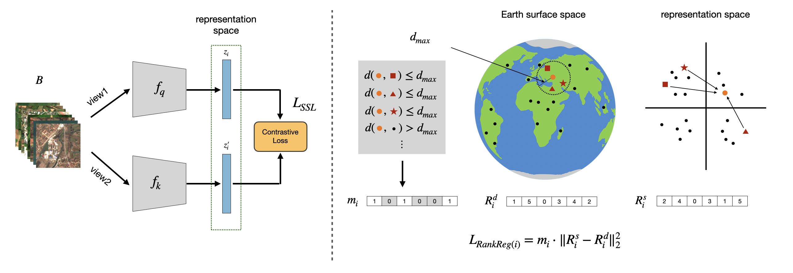

# GeoRank: Official Implementation

This repository is the official implementation of **“Rank-based Geographical Regularization: Revisiting Contrastive Self-Supervised Learning for Multispectral Remote Sensing Imagery”** -
Tom Burgert, Leonard Hackel, Paolo Rota, Begüm Demir @ *WACV 2025 (oral)*

[](https://arxiv.org/abs/2601.02289)

## Abstract / Description

This repository provides code to reproduce the experiments from the paper. The work studies contrastive self-supervised learning (SSL) for multispectral remote sensing imagery and introduces **GeoRank**, a rank-based geographical regularization method that incorporates geographical relationships into the learned feature space.

GeoRank uses spherical distances between image locations to regularize contrastive SSL objectives. The method is designed to improve representation learning for multispectral satellite images by exploiting the geographical structure of Earth observation data. In addition to introducing GeoRank, the repository includes experiments on key design choices for SSL in remote sensing, including data augmentations, dataset cardinality, image size, geographical sampling, temporal views, and downstream evaluation across classification and segmentation tasks.



## Installation

We recommend using conda:

```bash
git clone https://github.com/tomburgert/georank.git
cd georank

conda env create -f environment.yml
conda activate georank
```

Alternatively, dependencies can be installed with pip:

```bash
pip install -r requirements.txt
```

For GPU support, please install the PyTorch version that matches your CUDA version before installing the remaining dependencies. For example, for CUDA 12.1:

```bash
pip install torch==2.4.0 torchvision==0.19.0 --index-url https://download.pytorch.org/whl/cu121
pip install -r requirements.txt
```

## Data Preparation

The experiments use multispectral remote sensing datasets stored in LMDB format, with labels and split files provided separately as `.csv` or `.parquet` files.

The dataset paths are configured in:

```text
conf/datasets.yaml
```

Before running experiments, update the paths in `conf/datasets.yaml` to match your local data directories.

The repository contains configurations for datasets including:

* SSL4EO-S12
* SeCo
* BigEarthNet-V2
* Sen4AgriNet
* So2Sat
* EuroSAT-V2
* SeasonNet

Expected dataset entries include:

```yaml
lmdb_path: path/to/dataset.lmdb
labels_path: path/to/labels.parquet
train_csv: path/to/train.csv
val_csv: path/to/val.csv
test_csv: path/to/test.csv
num_classes: ...
num_channels: ...
task: single_label | multi_label | segmentation | unlabeled
```

For large-scale pretraining datasets, the code expects precomputed LMDB databases. If you use different dataset locations or split files, update `conf/datasets.yaml` accordingly.

## Usage

The main entry point for self-supervised pretraining and downstream evaluation is:

```bash
python ssl_experiments.py
```

The code uses Hydra configuration files from the `conf/` directory. Most experiment settings can be overridden directly from the command line.

### Example: self-supervised pretraining

```bash
python ssl_experiments.py \
  params.dataset=SSL4EO \
  ssl.algorithm=MoCoV2 \
  ssl.use_geography_loss=false \
  params.max_epochs=50 \
  model.name=resnet18 \
  model.channels=10 \
  dataset.batch_size=512 \
  logging.exp_dir=logs/seco_mocov2
```

### Example: GeoRank pretraining

```bash
python ssl_experiments.py \
  params.dataset=SSL4EO \
  ssl.algorithm=MoCoV2 \
  ssl.use_geography_loss=true \
  params.max_epochs=50 \
  model.name=resnet18 \
  model.channels=10 \
  dataset.batch_size=512 \
  logging.exp_dir=logs/seco_mocov2_georank
```

### Example: pretraining on a subset

The dataset configuration supports different subset sizes and split versions. For example:

```bash
python ssl_experiments.py \
  params.dataset=SSL4EO \
  dataset.pretrain_dataset_size=10 \
  dataset.pretrain_split_version=v1 \
  ssl.algorithm=MoCoV2 \
  ssl.use_geography_loss=true \
  logging.exp_dir=logs/ssl4eo_10pct_georank
```

### Downstream evaluation

After pretraining, the script evaluates learned representations on downstream datasets specified by:

```yaml
ssl.eval_datasets
```

in `conf/ssl_config.yaml`.

The evaluation pipeline includes:

* k-nearest-neighbor evaluation
* linear probing
* fine-tuning
* segmentation evaluation

You can enable or disable evaluation stages with:

```bash
ssl.skip_knn_eval=true
ssl.skip_linear_eval=false
ssl.skip_finetune_eval=true
```

For example:

```bash
python ssl_experiments.py \
  params.dataset=SSL4EO \
  ssl.algorithm=MoCoV2 \
  ssl.use_geography_loss=true \
  ssl.eval_datasets="[BigEarthNetV2,EuroSATV2,So2Sat_Random]" \
  ssl.skip_knn_eval=false \
  ssl.skip_linear_eval=false \
  ssl.skip_finetune_eval=true \
  logging.exp_dir=logs/georank_eval
```

## Configuration

The main configuration files are located in `conf/`:

```text
conf/
├── config.yaml          # General supervised/default configuration
├── ssl_config.yaml      # Self-supervised pretraining and evaluation setup
└── datasets.yaml        # Dataset paths, split files, task type, channels, classes
```

The most important command-line arguments are:

```text
params.dataset                 pretraining dataset
params.max_epochs              number of pretraining epochs
params.seed                    random seed
params.cuda_no                 GPU id used when bypassing SLURM

ssl.algorithm                  SSL algorithm, e.g. MoCoV2, DINO, BYOL
ssl.use_geography_loss         activate GeoRank geographical regularization
ssl.eval_datasets              downstream datasets for evaluation
ssl.skip_knn_eval              skip kNN evaluation
ssl.skip_linear_eval           skip linear probing
ssl.skip_finetune_eval         skip fine-tuning

model.name                     backbone architecture
model.channels                 number of input channels
model.pretrained               whether to use pretrained weights

dataset.batch_size             batch size
dataset.num_workers            number of dataloader workers
dataset.pretrain_dataset_size  subset size for pretraining
dataset.pretrain_image_size    image size variant
dataset.pretrain_loc           geographical sampling mode

logging.exp_dir                output directory
logging.ckpt_path              path to checkpoint for evaluation/resuming
logging.save_checkpoint        save model checkpoints
```

## Repository Structure

```text
georank/
├── conf/                  # Hydra configuration files
├── data/                  # Dataset, datamodule, and transform code
├── fast_soft_sort/        # Differentiable sorting/ranking utilities
├── lmdb/                  # LMDB-related utilities
├── models/                # Backbones and SSL model utilities
├── base.py                # Base modules
├── config.py              # Configuration dataclasses
├── eval_base.py           # Downstream evaluation modules
├── mlc_experiments.py     # Multi-label classification experiments
├── ssl_base.py            # Self-supervised learning methods
├── ssl_experiments.py     # Main SSL pretraining/evaluation entry point
├── ssl_croma.py           # CROMA-related experiments/adaptation
├── ssl_crossscale.py      # CrossScaleMAE-related experiments/adaptation
├── ssl_geoclip.py         # GeoCLIP-related experiments/adaptation
├── ssl_scalemae.py        # ScaleMAE-related experiments/adaptation
├── ssl_sota.py            # Additional SSL baselines
├── ssl_world.py           # World-scale SSL experiments/adaptation
└── utils.py               # GeoRank losses and utility functions
```

## Outputs

Training and evaluation logs are written to the directory specified by:

```bash
logging.exp_dir=<output_path>
```

PyTorch Lightning CSV logs and checkpoints are saved under this directory. If checkpoint saving is enabled, the best pretraining checkpoint is stored in the corresponding pretraining subdirectory and reused for downstream evaluation.

## Citation

If you use this code, please cite:

```bibtex
@inproceedings{burgert2026georank,
  title     = {Rank-based Geographical Regularization: Revisiting Contrastive Self-Supervised Learning for Multispectral Remote Sensing Imagery},
  author    = {Burgert, Tom and Hackel, Leonard and Rota, Paolo and Demir, Begüm},
  booktitle = {Proceedings of the IEEE/CVF Winter Conference on Applications of Computer Vision (WACV)},
  year      = {2026}
}
```
